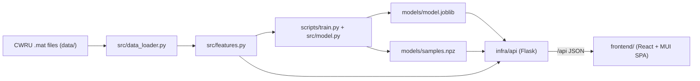

# Foreshock

**Vibration-based fault detection for rotating machinery**, inspired by aircraft
health-monitoring systems. Foreshock ingests accelerometer (vibration) signals
from a bearing, turns each signal window into a feature vector, and uses a
trained model to classify the bearing's condition — healthy vs. specific fault
types — with a confidence score. A web app lets you pick or upload a signal and
see its raw waveform, frequency spectrum, envelope spectrum, and the predicted
fault.

It runs on `localhost` (host or Podman) and is structured to deploy to a public
URL via a Cloudflare Tunnel.

---

## The predictive-maintenance story

Rolling-element bearings are everywhere in rotating machinery (motors, pumps,
turbines, aircraft accessories). When a bearing starts to fail, a tiny defect on
one surface strikes others once per revolution, producing periodic impulses in
the vibration signal. The repetition rate depends on *which* surface is damaged
and on the bearing geometry, giving four **characteristic fault frequencies**:

| Frequency | Meaning | Fault it indicates |
|-----------|---------|--------------------|
| **BPFO** | Ball Pass Frequency, Outer race | Outer-race defect |
| **BPFI** | Ball Pass Frequency, Inner race | Inner-race defect |
| **BSF**  | Ball Spin Frequency | Rolling-element (ball) defect |
| **FTF**  | Fundamental Train Frequency | Cage defect |

Those impulses are weak and buried in noise, so Foreshock uses **envelope
analysis** (a Hilbert transform) to demodulate the resonance and expose energy
at the fault frequencies, alongside classic **time-domain** health indicators
(RMS, kurtosis, crest factor, …) and the raw **FFT spectrum**. A RandomForest
classifies the resulting feature vector. Catching the signature early is the
essence of predictive maintenance: fix the bearing on a schedule instead of
suffering an unplanned failure.

---

## Architecture

Three cleanly decoupled layers — the engine knows nothing about the web, and the
web layers contain **no analysis logic**:



- **`src/`** — pure Python signal-processing + ML engine. UI-agnostic, no web code.
- **`infra/api/`** — Flask REST API (app-factory + blueprint). Imports `src/`, only marshals JSON.
- **`frontend/`** — React SPA. Calls the API and renders. No analysis.

This repo follows an in-house full-stack template's **folder design**: a Flask
`infra/api`, a React + Vite + TypeScript + MUI `frontend`, Podman pods under
`infra/podman`, a Cloudflare Tunnel under `infra/cloudflared`, and an fzf-based
`tools/cli`. The template's auth and PostgreSQL are intentionally omitted —
Foreshock is a stateless demo.

## Tech stack

| Layer | Choice |
|-------|--------|
| Engine | Python 3.11+, NumPy, SciPy, scikit-learn (RandomForest), joblib |
| API | Flask 3 + flask-cors (app-factory + blueprint), gunicorn for prod |
| Frontend | React 19, Vite, TypeScript (strict), MUI 7, React Router 7, Recharts |
| AI store | PostgreSQL + `pgvector` (relational + vector in one component) |
| LLM | Ollama - `llama3.2:1b` (generation) + `nomic-embed-text` (embeddings), local |
| Health model (v2) | scikit-learn MLP autoencoder + PCA (reconstruction-error indicator) |
| Streaming (v3) | Apache Kafka (KRaft) + kafka-python; live results to the browser via SSE |
| Infra | Podman pods (dev + prod), Cloudflare Tunnel |
| Tooling | fzf-based `cmds` runner |
| Tests | pytest (engine + API), Vitest + Testing Library (frontend) |
| Data | CWRU Bearing Data Center (12 kHz drive-end `.mat`) |

## Project structure

```
Foreshock/
├── src/                       # core engine (no web code)
│   ├── config.py              # sample rate, window size, bearing geometry, fault freqs
│   ├── data_loader.py         # load .mat, label, segment into windows (by recording)
│   ├── features.py            # time + frequency + envelope features; spectra helpers
│   ├── model.py               # scaler + RandomForest pipeline: train/eval/save/load
│   ├── health.py              # v2: autoencoder health indicator + 2-D embedding
│   ├── ims_loader.py          # v2: optional NASA IMS run-to-failure loader
│   └── synthetic.py           # random test-window generation (accuracy tester)
├── scripts/
│   ├── download_data.py       # fetch the CWRU subset into data/
│   ├── train.py               # load -> features -> split-by-recording -> train -> save
│   ├── seed_kb.py             # embed + load the RAG knowledge base into pgvector
│   ├── run_evals.py           # score the LLM/RAG layer
│   ├── train_health.py        # v2: train the health autoencoder + timeline
│   ├── download_ims.py        # v2: fetch NASA IMS (optional)
│   └── stream_producer.py     # v3: stream windows to Kafka
├── infra/
│   ├── api/                   # Flask API (thin; imports src/)
│   │   ├── app.py             # application factory + entry point
│   │   ├── engine.py          # loads model.joblib + samples.npz once
│   │   ├── predict.py         # /api blueprint: samples, signal, predict
│   │   ├── db.py              # Postgres + pgvector access layer
│   │   ├── llm.py             # Ollama client + AI observability logging
│   │   ├── rag.py             # pgvector retrieval
│   │   ├── agent.py           # diagnosis + agentic workflow + work orders
│   │   ├── evals.py           # eval harness
│   │   ├── ai.py              # /api blueprint: diagnose, agent, evals, observability
│   │   ├── health_routes.py   # v2: /api/health blueprint (trend + embedding)
│   │   ├── stream.py          # v3: Kafka consumer + SSE /api/stream blueprint
│   │   ├── requirements.txt
│   │   └── tests/             # pytest API tests
│   ├── database/              # numbered SQL migrations (pgvector schema)
│   ├── podman/                # foreshock-dev.yaml, foreshock-prod.yaml
│   └── cloudflared/           # tunnel configs (creds gitignored)
├── tools/cli/                 # fzf-based `cmds` runner (pods, api, cf, test)
├── frontend/                  # React + Vite + TS + MUI SPA
│   └── src/{api,components,hooks,pages,theme,test,__tests__}
├── models/                    # model.joblib + samples.npz (committed)
├── data/                      # downloaded .mat files (gitignored)
├── tests/                     # engine tests (test_features.py)
├── conftest.py                # puts repo root on sys.path for tests
├── pytest.ini
└── requirements-dev.txt
```

---

## Setup & run

### Option A — host dev (no containers)

```bash
# from the repo root
python3 -m venv .venv
source .venv/bin/activate                 # Windows: .venv\Scripts\activate
pip install -r infra/api/requirements.txt

# get the data and train the model (writes models/model.joblib + models/samples.npz)
python scripts/download_data.py
python scripts/train.py

# start the API (http://localhost:8000)
cd infra/api && python app.py
```

In a second terminal:

```bash
cd frontend
npm install
npm run dev                                # http://localhost:5173 (proxies /api -> :8000)
```

Open <http://localhost:5173>.

> **Port note:** host dev uses API port **8000** (macOS reserves 5000 for the
> AirPlay Receiver). The Podman pods use 5000 internally.

#### AI diagnostics (optional)

The AI layer needs a local LLM (Ollama) and Postgres + pgvector:

```bash
# Ollama + tiny models (one-time). Bind 0.0.0.0 if the Podman pod must reach it.
ollama serve            # or the Ollama.app; OLLAMA_HOST=0.0.0.0:11434 for pods
ollama pull llama3.2:1b
ollama pull nomic-embed-text

# Postgres + pgvector for host dev (the Podman pod ships its own).
podman run -d --name foreshock-pg -p 5432:5432 \
  -e POSTGRES_USER=postgres -e POSTGRES_PASSWORD=postgres -e POSTGRES_DB=foreshock \
  -v "$PWD/infra/database:/docker-entrypoint-initdb.d:ro" \
  docker.io/pgvector/pgvector:pg16

# Seed the knowledge base, then run the API with DB + Ollama env.
python scripts/seed_kb.py
python scripts/run_evals.py     # optional: score the LLM/RAG layer
cd infra/api && DB_HOST=localhost OLLAMA_HOST=http://localhost:11434 python app.py
```

Open the **Diagnostics** tab in the UI for RAG diagnosis, the agent, evals, and
the AI observability panel. In the Podman pod these are wired automatically
(a `postgres-db` container + `OLLAMA_HOST=http://host.containers.internal:11434`).

### Option B — Podman pods

Requires the `podman` CLI and a running Podman machine
(`podman machine init && podman machine start` on macOS). Train the model first
(Option A steps for download + train) so `models/` is populated.

```bash
podman play kube infra/podman/foreshock-dev.yaml
# frontend: http://localhost:3000   API: http://localhost:8000 (container port 5000)
```

Or use the interactive runner (needs `fzf`):

```bash
alias cmds='bash tools/cli/cmds.sh'
cmds pods        # start/stop/rebuild/logs
cmds api         # health, samples, predict, logs
cmds test        # run test suites
cmds cf          # Cloudflare Tunnel setup
```

### Public URL (optional)

Configure a Cloudflare Tunnel in `infra/cloudflared/` (see SETUP.md), then run
the prod pod (`infra/podman/foreshock-prod.yaml`) which builds the SPA, serves
it, and routes `/api/*` to the API.

## API

| Method | Endpoint | Description |
|--------|----------|-------------|
| `GET`  | `/api/samples` | List built-in sample signals (one per condition). |
| `GET`  | `/api/signal/<id>` | Downsampled waveform + FFT spectrum + envelope spectrum + fault frequencies. |
| `POST` | `/api/predict` | Predict a condition for a `sample_id` (form field) or an uploaded `file` (`.mat`/`.csv`). Returns prediction, per-class probabilities, and feature values. |
| `POST` | `/api/random_test` | Generate a random labeled window (optional `noise` stress level) and return predicted vs. actual - powers the interactive accuracy tester. |
| `GET`  | `/health` | Liveness check. |
| `GET`  | `/api/ai/status` | DB / LLM / knowledge-base availability + model names. |
| `POST` | `/api/diagnose` | RAG + LLM structured diagnosis (sample id or upload) with sources. |
| `POST` | `/api/agent` | Agentic workflow: analyze -> retrieve -> trend -> draft work order. |
| `GET`  | `/api/observability` | LLM latency, token usage, retrieval quality. |
| `GET` / `POST` | `/api/evals` , `/api/evals/run` | Latest eval report / run the suite. |
| `GET`  | `/api/work_orders` | Recent draft work orders. |
| `GET`  | `/api/health/trend` | v2: reconstruction-error run-to-failure timeline + alarm threshold. |
| `GET`  | `/api/health/embedding` | v2: 2-D embedding (healthy clustering, faults drifting away). |
| `GET`  | `/api/stream` | v3: SSE stream of live inferred windows. |
| `POST` | `/api/stream/simulate` | v3: start a simulated Kafka sensor feed. |
| `GET`  | `/api/stream/status` | v3: Kafka availability + stream state. |

## AI diagnostics layer (local LLM)

On top of the classifier, Foreshock adds a small, fully local AI layer (no API
keys, no cloud) in `infra/api/`:

- **RAG + LLM diagnosis** (`/api/diagnose`) - retrieves bearing-fault knowledge
  from a `pgvector` store and asks `llama3.2:1b` for a grounded, structured
  diagnosis (summary, likely cause, severity, recommended actions) with the
  retrieved sources. Postgres + pgvector covers the relational *and* vector
  store in one component.
- **Agentic workflow** (`/api/agent`) - on a detected anomaly the agent runs the
  chain itself: pull signal -> analyze -> retrieve knowledge -> check the health
  trend (vs. previous readings for the asset) -> emit a structured maintenance
  recommendation and a draft work order. Steps are returned for transparency.
- **Eval harness** (`scripts/run_evals.py`, `/api/evals`) - scores the LLM/RAG
  layer over fault scenarios: diagnosis accuracy, retrieval precision/recall, and
  a hallucination check. Results persist to `eval_runs` and surface in the UI.
- **AI observability** (`/api/observability`) - every LLM/embedding call logs
  latency, token usage, and retrieval quality to `llm_calls`, shown in a panel.

The layer **degrades gracefully**: with no LLM it falls back to templated
recommendations; with no database the core waveform/spectrum/prediction demo
still works.

## How it works (pipeline)

1. **Load & window** ([src/data_loader.py](src/data_loader.py)) — read the
   drive-end accelerometer series from each `.mat`, split into overlapping
   2048-sample windows tagged with the source recording id.
2. **Feature extraction** ([src/features.py](src/features.py)) — 16 ordered
   features per window: time-domain (RMS, peak, peak-to-peak, kurtosis, skewness,
   crest factor, std), FFT band energy around BPFO/BPFI/BSF/FTF + spectral
   centroid, and envelope-spectrum peak energy at each fault frequency.
3. **Train** ([scripts/train.py](scripts/train.py)) — a
   `StandardScaler -> RandomForest` pipeline, split **by recording**
   (`StratifiedGroupKFold`) so windows from one recording never appear in both
   train and test (prevents window leakage).
4. **Serve & predict** ([infra/api/predict.py](infra/api/predict.py)) — the API
   windows the chosen signal, extracts features, and averages class
   probabilities across windows.

## Testing

```bash
pip install -r requirements-dev.txt
pytest                              # engine + API tests

cd frontend && npm test            # Vitest (api client + module)
```

## Notes & caveats

- **Dataset:** [CWRU Bearing Data Center](https://engineering.case.edu/bearingdatacenter)
  12 kHz drive-end data (SKF 6205 bearing, 0.007" EDM faults), four conditions
  across motor loads 0–3 HP. `data/` is gitignored.
- **Accuracy:** CWRU at a fixed fault diameter is highly separable, so held-out
  accuracy is ~100%. The split-by-recording guard makes that number honest.
- **Scope:** no auth, no database (stateless).

### Manual data download (fallback)

`scripts/download_data.py` tries the official host automatically. If it can't
reach it, download these from the
[Normal Baseline](https://engineering.case.edu/bearingdatacenter/normal-baseline-data)
and [12k Drive-End](https://engineering.case.edu/bearingdatacenter/12k-drive-end-bearing-fault-data)
pages:

| Condition | Files | Destination |
|-----------|-------|-------------|
| Normal | 97, 98, 99, 100 | `data/normal/<n>.mat` |
| Inner race (0.007") | 105, 106, 107, 108 | `data/inner_race/<n>.mat` |
| Outer race @6 (0.007") | 130, 131, 132, 133 | `data/outer_race/<n>.mat` |
| Ball (0.007") | 118, 119, 120, 121 | `data/ball/<n>.mat` |

## Screenshots

> Run the app and open the UI, then drop screenshots here (e.g. `docs/`).

## Predictive-maintenance lifecycle (v2 + v3, implemented)

- **v2 - catch failures earlier (Health tab).** A feature-space autoencoder
  trained on healthy data only; reconstruction error is an unsupervised health
  indicator that rises before a hard fault, with a 2-D embedding showing healthy
  data clustering and faults drifting away. Runs on a run-to-failure timeline
  (CWRU-derived by default; drop in the real NASA IMS set via
  `scripts/download_ims.py` + `data/ims/` and it is used automatically). Train:
  `python scripts/train_health.py`.
- **v3 - live sensor feed (Live tab).** Signal windows stream through Kafka; a
  background consumer runs inference on each and pushes results to the browser
  over SSE. Start a simulated feed from the UI, or
  `python scripts/stream_producer.py`.

### Further ideas

- Real IMS run-to-failure ingestion at scale; richer remaining-useful-life trends.
- Multi-partition Kafka + a dedicated consumer service for horizontal scale.

## More docs

- [SETUP.md](SETUP.md) — step-by-step bring-up (host + Podman + tunnel).
- [CLAUDE.md](CLAUDE.md) — architecture conventions for contributors/AI assistants.

## License

MIT — see [LICENSE](LICENSE).
